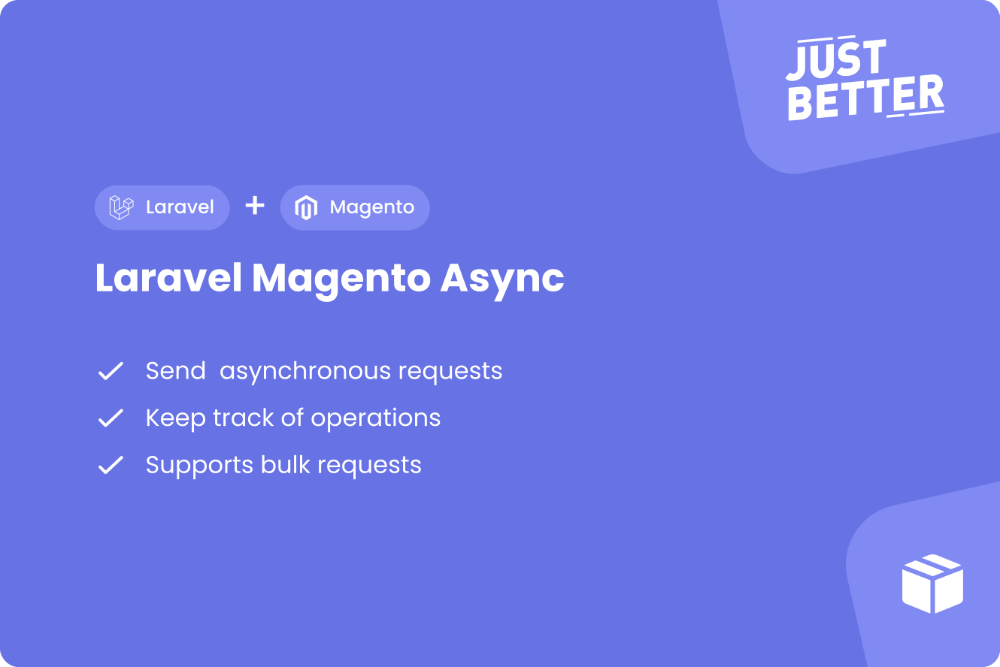

<a href="https://github.com/justbetter/laravel-magento-async" title="JustBetter">
    
</a>

# Laravel Magento Async

<p>
    <a href="https://github.com/justbetter/laravel-magento-async"></a>
    <a href="https://github.com/justbetter/laravel-magento-async"></a>
    <a href="https://github.com/justbetter/laravel-magento-async"></a>
    <a href="https://github.com/justbetter/laravel-magento-async"></a>
</p>

This package provides a way to store async/bulk requests to Magento to later retrieve the status of the operation and handle the status.
It works by storing the send async request with the operations in the database and retrieving the statuses periodically.

Once the status of an operation changes an event is fired.
It is possible to relate any model to an operation which makes it possible to know where the operation originates from and handle the operation result.


## Installation

This package is an extension of [justbetter/laravel-magento-client](https://github.com/justbetter/laravel-magento-client/).
Be sure to install and configure that package first.

Require this package:

```shell
composer require justbetter/laravel-magento-async
```

Optionally, publish the configuration file of this package to edit the queue and cleanup time.

```bash
php artisan vendor:publish --provider="JustBetter\MagentoAsync\ServiceProvider" --tag=config
```

### Scheduler

In order to update and cleanup the statuses of the async operation two commands are required in your scheduler:

```php
<?php

protected function schedule(Schedule $schedule): void
{
    $schedule->command(\JustBetter\MagentoAsync\Commands\UpdateBulkStatusesCommand::class)->everyFiveMinutes();
    $schedule->command(\JustBetter\MagentoAsync\Commands\CleanBulkRequestsCommand::class)->everyFiveMinutes();
}
```

## Usage

This package provides a `MagentoAsync` client to send requests.
An event will later be dispatched by the package to inform the application that the operation has been processed
You can listen to this event to handle the operation result.

### Sending the request

To send an async (bulk) request using this package use the `MagentoAsync` client:

```php
<?php

public function __construct(
    protected \JustBetter\MagentoAsync\Client\MagentoAsync $magentoAsync
) {}
...
public function handle(string $store): void {
    $products = Product::query()->take(1000)->get();

    $payload = $products
        ->map(fn(Product $product) => ['product' => ['sku' => $product->sku, 'status' => $product->status]])
        ->toArray();

    $this->magentoAsync
        ->configure(fn (Magento $magento): Magento => $magento->store($store)) // Optionally configure the Magento client
        ->subjects($products->all()) // Pass the models in the same order as the payload
        ->postBulk('products', $payload); // Bulk post this payload to the `products` endpoint
}
```

The subjects array is a list of models, the indexes have to match with the payload in order to bind Magento's operation id with the correct model.

When sending non-bulk requests a `->subject()` method is available:

```php
<?php

public function __construct(
    protected \JustBetter\MagentoAsync\Client\MagentoAsync $magentoAsync
) {}
...
public function handle(): void {
    $product = Product::query()->first();

    $payload =  ['product' => ['sku' => $product->sku, 'status' => $product->status]];

    $this->magentoAsync
        ->subject($product) // Pass the subject
        ->post('products', $payload); // Post this payload to the `products` endpoint
}
```

### Retrieving the operation status

This package provides an event that dispatches for all operations: `\JustBetter\MagentoAsync\Events\BulkOperationStatusEvent`.
The event includes the bulk operation that has been updated for you to handle the response.

> This event dispatches for all operation changes, you can use the operation model to determine what endpoint was called

If you have bound a subject the package provides an abstract listener `\JustBetter\MagentoAsync\Listeners\BulkOperationStatusListener`.
This class provides a way to filter on a specific model and ignore the `Open` status.

Example implementation:

```php
<?php

use \JustBetter\MagentoAsync\Listeners\BulkOperationStatusListener as BaseBulkOperationStatusListener;
use \JustBetter\MagentoAsync\Models\BulkOperation;
use \JustBetter\MagentoAsync\Enums\OperationStatus;

class BulkOperationStatusListener extends BaseBulkOperationStatusListener
{
    protected string $model = Product::class;

    public function execute(BulkOperation $operation): void
    {
        /** @var Model $status */
        $status = $operation->subject;

        if ($operation->status === OperationStatus::Complete) {
            // Handle complete status
            return;
        }

        // Handle failed status
    }
}
```

## Quality

To ensure the quality of this package, run the following command:

```shell
composer quality
```

This will execute three tasks:

1. Makes sure all tests are passed
2. Checks for any issues using static code analysis
3. Checks if the code is correctly formatted

## Contributing

Please see [CONTRIBUTING](.github/CONTRIBUTING.md) for details.

## Security Vulnerabilities

Please review [our security policy](../../security/policy) on how to report security vulnerabilities.

## Credits

- [Vincent Boon](https://github.com/VincentBean)
- [Ramon Rietdijk](https://github.com/ramonrietdijk)
- [All Contributors](../../contributors)

## License

The MIT License (MIT). Please see [License File](LICENSE) for more information.

<a href="https://justbetter.nl" title="JustBetter">
    
</a>

